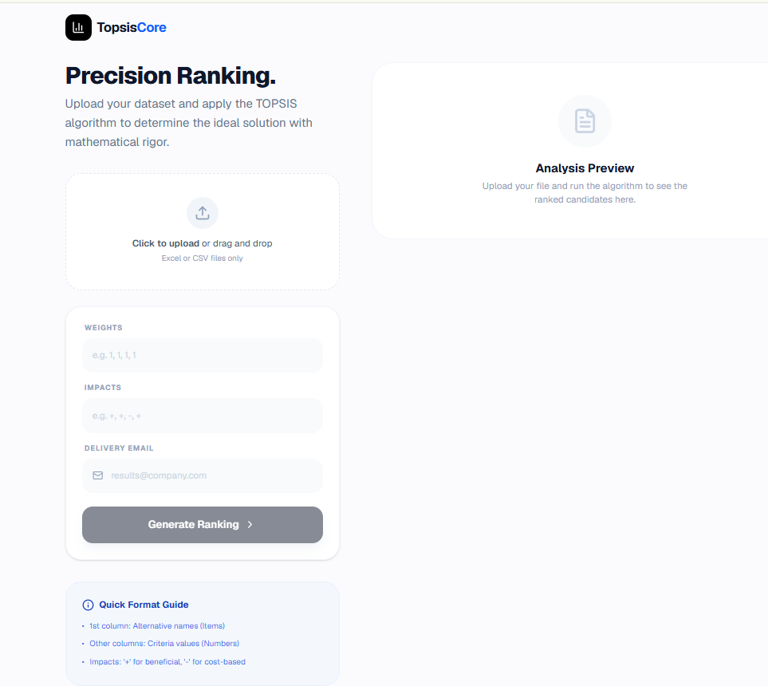
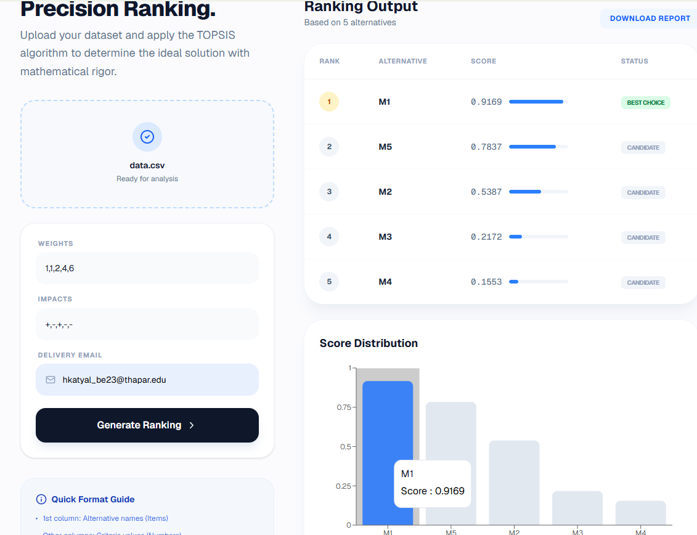
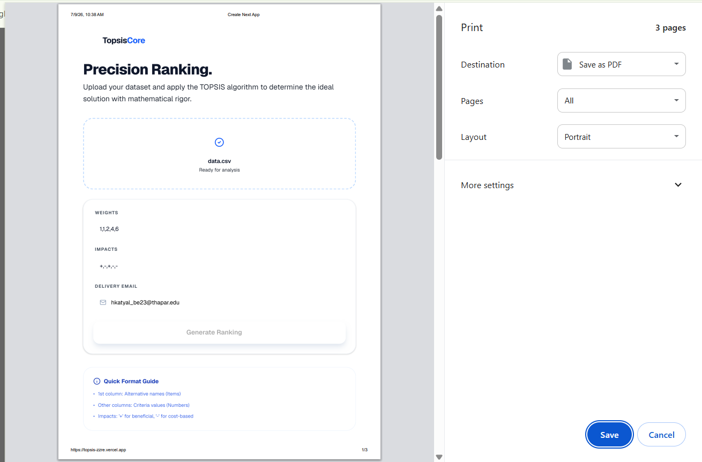
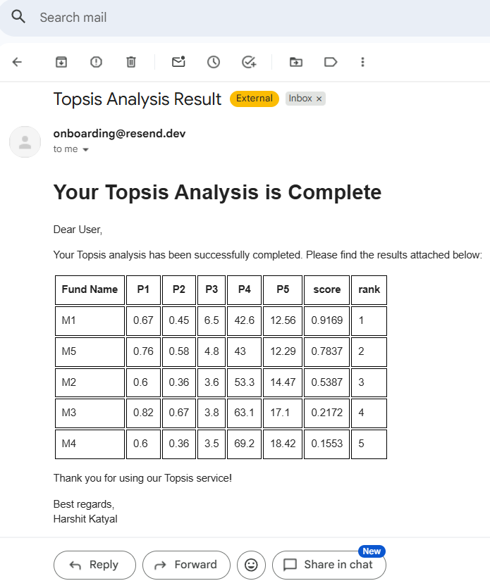
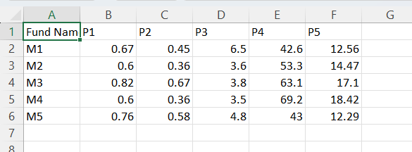
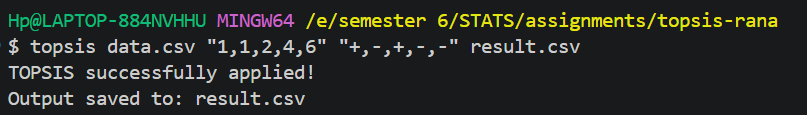
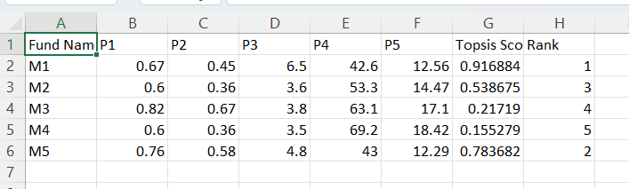

# TopsisCore

> **Multi-Criteria Decision Making — Made Simple.**  
> A Python package + web platform implementing the TOPSIS algorithm to rank alternatives based on weighted criteria.

[](https://pypi.org/project/topsis-core/)
[](https://www.python.org/)
[](https://topsis-zzre.vercel.app)
[](LICENSE)

---

## What is TOPSIS?

**TOPSIS (Technique for Order of Preference by Similarity to Ideal Solution)** is a multi-criteria decision-making algorithm. It ranks a set of alternatives by finding which one is closest to the ideal best solution and farthest from the ideal worst solution.

**Real-world use cases:**
- Selecting the best ML model from multiple benchmarked models
- Ranking suppliers/vendors based on cost, quality, and delivery
- Shortlisting candidates in hiring based on weighted criteria
- Comparing investment funds based on performance metrics
- Any decision problem with multiple conflicting criteria

---

## Project Components

| Component | Description | Link |
|---|---|---|
| 🐍 PyPI Package | CLI tool — run TOPSIS from terminal | [topsis-core](https://pypi.org/project/topsis-core/) |
| 🌐 Web Platform | Upload CSV, configure weights, get ranked results + email delivery | [topsis-zzre.vercel.app](https://topsis-zzre.vercel.app) |

---

## Web Platform

No installation needed — upload your dataset directly in the browser.

### Homepage


### Results with Score Distribution Chart


### Downloadable Report (PDF)


### Email Delivery
Results are automatically emailed after analysis.



---

## CLI Package

### Installation

```bash
pip install topsis-core
```

### Command Format

```bash
topsis <InputDataFile> <Weights> <Impacts> <ResultFileName>
```

### Parameters

| Parameter | Description |
|---|---|
| `InputDataFile` | Path to `.csv` or `.xlsx` file (3+ columns required) |
| `Weights` | Comma-separated importance values e.g. `"1,1,2,1"` |
| `Impacts` | Comma-separated `+` or `-` per criterion |
| `ResultFileName` | Output CSV filename |

- **First column** — alternative names (M1, M2 etc.) — not used in calculations
- **Remaining columns** — numeric criteria values
- `+` → higher is better (benefit criterion)
- `-` → lower is better (cost criterion)

---

## Example Walkthrough

### Input Data (`data.csv`)

Ranking 5 mutual funds based on 5 performance parameters:



### Run the Command

```bash
topsis data.csv "1,1,2,4,6" "+,-,+,-,-" result.csv
```

### CLI Output



### Result (`result.csv`)

TOPSIS Score and Rank columns are appended to the original data:



---

## Tech Stack

| Layer | Technology |
|---|---|
| Algorithm | Python, NumPy, Pandas |
| CLI | Python `sys.argv`, entry points via `pyproject.toml` |
| Web Frontend | Next.js, Tailwind CSS, Recharts |
| Email Delivery | Resend API |
| Package Registry | PyPI (`topsis-core`) |
| Deployment | Vercel |

---

## Repository Structure

```
topsis-rana/
├── package/               # PyPI package source
│   ├── src/
│   │   └── topsis_core/
│   │       └── __init__.py   # Core TOPSIS logic + CLI entry
│   └── pyproject.toml
├── topsis-website/        # Next.js web platform
│   ├── app/
│   │   ├── page.tsx          # Main UI with file upload + chart
│   │   └── api/send-email/   # Resend email API route
│   └── package.json
├── data.csv               # Sample input file
└── result.csv             # Sample output file
```

---

## Author

**Harshit Katyal**  
B.E. Computer Engineering — Thapar Institute of Engineering & Technology  
[GitHub](https://github.com/HarshitCodes16) • [LinkedIn](https://www.linkedin.com/in/harshit-katyal-038825297/) • [PyPI](https://pypi.org/project/topsis-core/)
